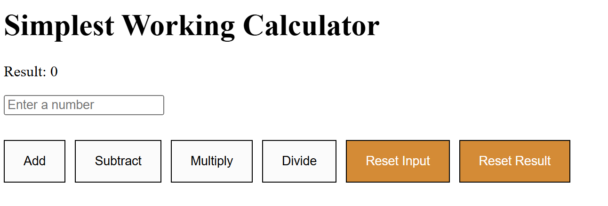

# Simplest Working Calculator

A simple calculator built using React. This application allows you to perform basic arithmetic operations such as addition, subtraction, multiplication, and division. The input value is taken from a text field, and results are updated dynamically.

## Features

- **Basic Arithmetic Operations**: Perform addition, subtraction, multiplication, and division.
- **Input Validation**: Ensures that only valid numbers are used.
- **Error Handling**: Alerts the user if they try to divide by zero or enter an invalid input.
- **Reset**: Resets the input or result to start fresh.

## Demo


You can interact with the application by typing numbers into the input field and clicking the respective operation buttons.

## Technologies Used

- **React**: The application is built using React to create an interactive UI.
- **CSS**: Basic styling is applied to create a clean and functional layout.
- **JavaScript**: The app utilizes JavaScript for the logic behind arithmetic operations and input handling.

## Getting Started

To run this project locally, follow these steps:

### Prerequisites

Ensure you have the following installed:

- **Node.js** (>= 14.0.0)
- **npm** (Node package manager)

### Installation

1. Clone the repository:

   ```bash
   git clone https://github.com/your-username/calculator-app.git
   cd calculator-app

2. Install the dependencies:
   ```bash
   npm install

3. Start the development server:
   ```bash
   npm start

This will open the application in your default browser (usually at http://localhost:3000).

## App Structure
- **App.js**: Contains the logic and JSX structure for the calculator.
- **App.css**: Contains styles for the calculator layout and buttons.
- **public/**: Contains the index.html file and public assets.
- **src/**: Contains the React component files.

## Known Issues
- The current version only handles integer values. Decimal or float inputs are not validated.
- Division by zero is handled, but no further advanced error handling is included yet.
